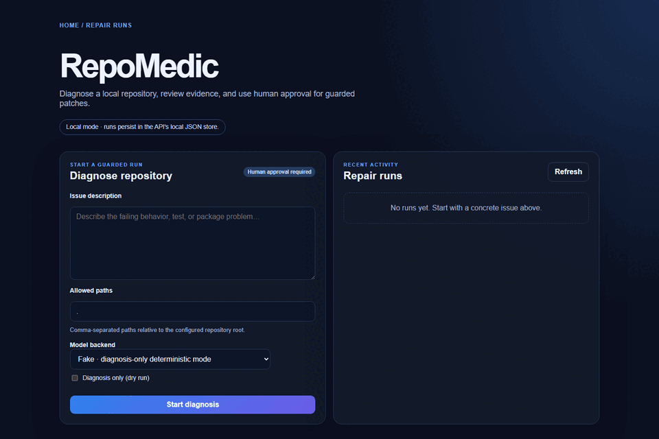

# RepoMedic AI

<p align="center">
  
</p>

<div align="center">

[](https://github.com/JasonTM17/RepoMedic_AI/actions/workflows/ci.yml)
[](https://hub.docker.com/r/nguyenson1710/repomedic-api)
[](https://github.com/JasonTM17/RepoMedic_AI/pkgs/npm/%40jasonTM17%2Fcore)
[](LICENSE)

**Local-first AI bug triage and guarded patch assistant**

[Features](#features) • [Quick Start](#quick-start) • [Usage](#usage) • [Architecture](#architecture) • [Development](#development) • [Contributing](#contributing)

</div>

---

## Features

- **AI-Powered Triage**: Automatically diagnose and triage bugs in your repository
- **Guarded Patch Application**: Apply patches only after human approval
- **Security-First Design**: Path allowlisting, mutation policies, and bounded execution
- **Multi-Platform Support**: Works on Windows, macOS, and Linux
- **CLI repair workflow**: Run the guarded triage and patch pipeline locally
- **API/Web repair workflow**: Diagnose, review evidence, approve/reject, and
  run bounded guarded patches through the local API and dashboard

## Quick Start

### Prerequisites

- Node.js 22 or newer
- npm 10 or newer
- Docker Desktop (for containerized deployment)

### Installation

```bash
# Clone the repository
git clone https://github.com/JasonTM17/RepoMedic_AI.git
cd RepoMedic_AI

# Install dependencies
npm install

# Build all packages
npm run build

# Run tests
npm test
```

### Local Docker validation

```bash
# Build and run the local Compose services
docker compose up --build
```

Compose binds the current checkout to the API at `/workspace/repository`,
persists run evidence in `.repomedic/`, and publishes both services only on
loopback. Run it only against a repository you intend to give the guarded
workflow access to; file mutations still require human approval.

Registry publication and deployment are separate release activities; this
repository does not claim that the example images are currently published.

## Usage

### CLI

```bash
# Triage a repository
npm run repomedic -- triage /path/to/repository

# Or use the built CLI
node apps/cli/dist/index.js triage /path/to/repository
```

### API and web dashboard

```bash
# Start the dashboard
npm run dev:web

# Start the API
npm run dev:api

# Start both services with the alternate local ports (4400 / 4300)
docker compose -f docker-compose.yml -f docker-compose.local.yml up --build
```

The API exposes `/healthz`, `/readyz`, `/metrics`, and the repair lifecycle at
`/v1/repairs`. The dashboard connects through the generated
`@jasonTM17/api-client` package. By default, runs are local and persist under
`.repomedic/`; interrupted runs are recovered as `recovery-required` and cannot
continue mutating automatically. Select the `openai` backend only after
configuring `OPENAI_API_KEY`; the `fake` backend is diagnosis-only and
deterministic for local UI verification.

## Visual walkthrough

The walkthrough below is a captured local session of the built dashboard. It
shows the empty state, an issue being prepared, and a completed deterministic
diagnosis-only run. It does not claim a live model integration or a production
patch application.



See [the visual walkthrough notes](docs/showcase.md) for responsive screenshots,
capture provenance, and the exact limits of this evidence.

## Architecture

### System Overview

```
┌─────────────────────────────────────────────────────────────────┐
│                        RepoMedic AI                              │
├─────────────────────────────────────────────────────────────────┤
│  ┌─────────────┐    ┌─────────────┐    ┌─────────────────────┐ │
│  │   CLI App   │    │  Web App    │    │    API Server       │ │
│  │  (Commander)│    │  (Next.js)  │    │    (Express)        │ │
│  └──────┬──────┘    └──────┬──────┘    └──────────┬──────────┘ │
│         │                  │                       │            │
│         └──────────────────┼───────────────────────┘            │
│                            │                                     │
│                   ┌────────▼────────┐                           │
│                   │   Core Package  │                           │
│                   │  (Domain/Policy)│                           │
│                   └────────┬────────┘                           │
│                            │                                     │
│         ┌──────────────────┼──────────────────┐                 │
│         │                  │                  │                 │
│  ┌──────▼──────┐    ┌──────▼──────┐    ┌─────▼─────┐          │
│  │  fs-guard   │    │ exec-guard  │    │   Tools   │          │
│  │ (File Ops)  │    │ (Cmd Exec)  │    │ (Git/Repo)│          │
│  └─────────────┘    └─────────────┘    └───────────┘          │
└─────────────────────────────────────────────────────────────────┘
```

### Security Model

| Component             | Protection                                         |
| --------------------- | -------------------------------------------------- |
| `SecureFileSystem`    | Core runtime realpath + path allowlisting          |
| `boundedExec`         | Core runtime command allowlist, no shell, bounds   |
| `SecureFileAccessor`  | Standalone package realpath + policy callback      |
| `SecureCommandRunner` | Standalone package no-shell execution + bounds     |
| `MutationPolicy`      | Blocks `.git/`, `.env*`, and other sensitive paths |
| `PathAllowlistPolicy` | Rejects `../`, absolute paths, symlink escapes     |

## Development

### Project Structure

```
RepoMedic_AI/
├── apps/
│   ├── api/          # Express REST API
│   ├── cli/          # Commander CLI
│   └── web/          # Next.js dashboard
├── packages/
│   ├── core/         # Domain, schemas, policies
│   ├── fs-guard/     # Secure file operations
│   ├── exec-guard/   # Secure command execution
│   └── api-client/   # Generated OpenAPI client
├── docs/
│   ├── architecture.md
│   └── security.md
└── evals/            # Evaluation suite
```

### Available Scripts

```bash
# Build all packages
npm run build

# Run tests
npm test

# Type checking
npm run typecheck

# Linting
npm run lint

# Format code
npm run format

# Start development servers
npm run dev:api    # Start API server
npm run dev:web    # Start the dashboard
```

## Contributing

Contributions are welcome! Please feel free to submit a Pull Request.

1. Fork the repository
2. Create your feature branch (`git checkout -b feature/amazing-feature`)
3. Commit your changes (`git commit -m 'feat: add amazing feature'`)
4. Push to the branch (`git push origin feature/amazing-feature`)
5. Open a Pull Request

## License

This project is licensed under the MIT License - see the [LICENSE](LICENSE) file for details.

## Support

- 📖 [Documentation](docs/)
- 🐛 [Issue Tracker](https://github.com/JasonTM17/RepoMedic_AI/issues)
- 💬 [Discussions](https://github.com/JasonTM17/RepoMedic_AI/discussions)

---

<p align="center">
  Made with ❤️ by <a href="https://github.com/JasonTM17">JasonTM17</a>
</p>
