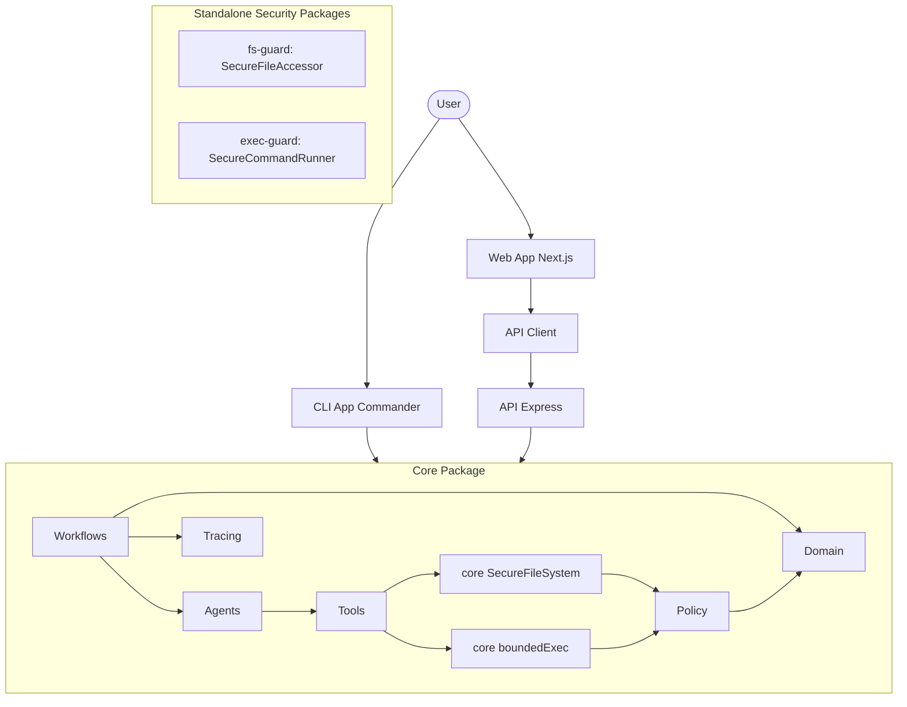

# Architecture

## Overview

RepoMedic is a local-first AI bug triage and guarded patch assistant, organized as a monorepo with multiple packages and applications.

## Packages

- **core**: Deterministic domain entities, schemas, policy logic, the active
  `SecureFileSystem`/`boundedExec` runtime boundaries, agent abstractions,
  workflows, and tracing.
- **fs-guard**: Standalone reusable filesystem wrapper providing
  `SecureFileAccessor` with realpath confinement and a caller-supplied policy
  callback. It is configured for independent publication and is not a core
  runtime dependency today.
- **exec-guard**: Standalone reusable command execution wrapper providing
  `SecureCommandRunner` with cwd confinement, timeouts, output limits, and an
  explicit environment allowlist. It is configured for independent
  publication and is not a core runtime dependency today.
- **api-client**: Generated OpenAPI client for interacting with the API.

## Apps

- **cli**: Command-line interface for running RepoMedic commands locally (`apps/cli`).
- **api**: Express health/readiness/metrics scaffold; repair endpoints remain
  deferred (`apps/api`).
- **web**: Next.js dashboard scaffold; repair visualization and workflow
  management remain deferred (`apps/web`).

## Core Modules

The `core` package encapsulates the fundamental logic of RepoMedic:

- **Domain**: Data models and domain entities (`RepositoryTarget`, `DiagnosisIssue`, `PatchOperation`, `PatchProposal`, `CheckResult`, `Approval`, `MutationDecision`).
- **Schemas**: Zod runtime-validated schemas for all public boundary values.
- **Policy**: Access and modification policies (`PathAllowlistPolicy`, `MutationPolicy`) — the single gate all mutations pass through.
- **SecureFS**: Active core filesystem abstraction with syntactic policy checks
  and resolved-root confinement. `packages/fs-guard` contains the separate
  reusable `SecureFileAccessor` boundary.
- **BoundedExec**: Active core command allowlist, argument-array execution,
  timeout, and output bounds. `packages/exec-guard` contains the separate
  reusable `SecureCommandRunner` boundary.
- **Tools**: Reusable utilities for repository operations and patch management.
- **Agents**: AI agent definitions for exploration, patching, and review.
- **Workflows**: Coordinator and bounded-retry workflow orchestration.
- **Tracing**: Observability and telemetry for system actions.

## Architecture Diagram

