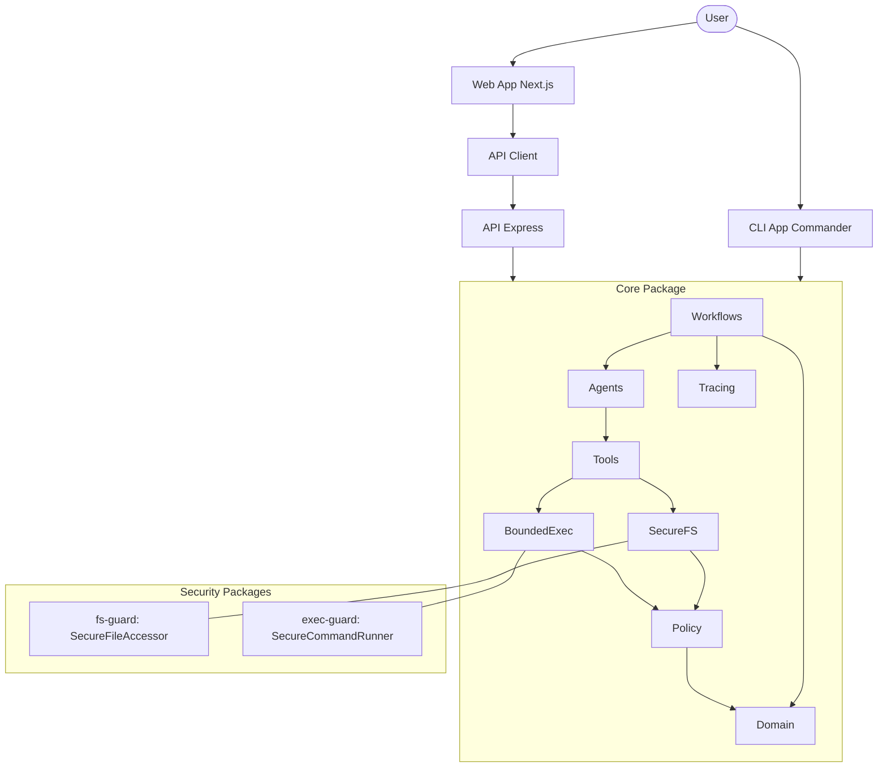

# Architecture

## Overview

RepoMedic is a local-first AI bug triage and guarded patch assistant, organized as a monorepo with multiple packages and applications.

## Packages

- **core**: Deterministic domain entities, schemas, and policy logic. Contains `PathAllowlistPolicy`, `MutationPolicy`, agent abstractions, workflows, and tracing.
- **fs-guard**: Secure filesystem wrapper providing `SecureFileAccessor` with TOCTOU protection and symlink confinement.
- **exec-guard**: Secure command execution with `SecureCommandRunner` enforcing timeouts, buffer limits, and environment sanitization.
- **api-client**: Generated OpenAPI client for interacting with the API.

## Apps

- **cli**: Command-line interface for running RepoMedic commands locally (`apps/cli`).
- **api**: Express REST API service for core functionalities (`apps/api`).
- **web**: Next.js dashboard for visualizing results and managing workflows (`apps/web`).

## Core Modules

The `core` package encapsulates the fundamental logic of RepoMedic:

- **Domain**: Data models and domain entities (`RepositoryTarget`, `DiagnosisIssue`, `PatchOperation`, `PatchProposal`, `CheckResult`, `Approval`, `MutationDecision`).
- **Schemas**: Zod runtime-validated schemas for all public boundary values.
- **Policy**: Access and modification policies (`PathAllowlistPolicy`, `MutationPolicy`) — the single gate all mutations pass through.
- **SecureFS**: Secure file system abstractions (moved to `packages/fs-guard`).
- **BoundedExec**: Safe command execution (moved to `packages/exec-guard`).
- **Tools**: Reusable utilities for repository operations and patch management.
- **Agents**: AI agent definitions for exploration, patching, and review.
- **Workflows**: Coordinator and bounded-retry workflow orchestration.
- **Tracing**: Observability and telemetry for system actions.

## Architecture Diagram

