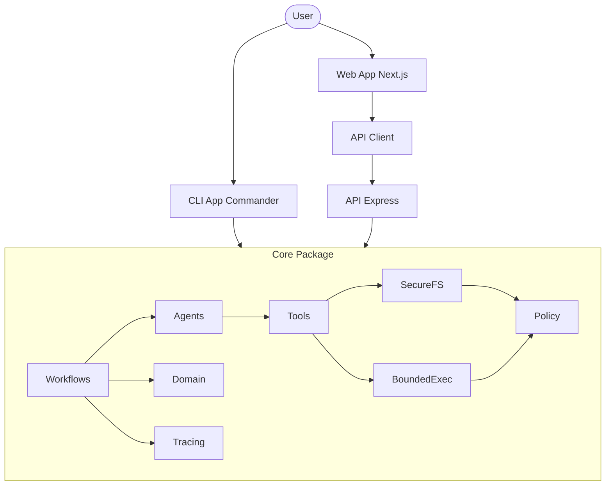

# Architecture

## Overview
RepoMedic is a local-first AI bug triage and guarded patch assistant, organized as a monorepo with multiple packages and applications.

## Packages
- **core**: Contains deterministic repair and security logic, domain entities, policies, file system operations, tool definitions, agent behaviors, workflows, and tracing.
- **api-client**: Generated API client for interacting with the `api`.

## Apps
- **cli**: Command-line interface for running RepoMedic commands locally (`apps/cli`).
- **api**: Express REST API service for interacting with core functionalities (`apps/api`).
- **web**: Next.js local dashboard for visualizing results, tracking workflows, and managing the AI assistant (`apps/web`).

## Core Modules
The `core` package encapsulates the fundamental logic of RepoMedic:
- **Domain**: Data models and domain entities.
- **Policy**: Access and modification policies (e.g., `PathAllowlistPolicy`, `MutationPolicy`).
- **SecureFS**: Secure file system abstractions restricting operations within bounded directories.
- **BoundedExec**: Safe and restricted execution environment for running external commands or scripts.
- **Tools**: Reusable utilities and integrations for agents.
- **Agents**: AI agent definitions and logic for interacting with tools and LLMs.
- **Workflows**: Orchestration of complex multi-step processes like triage and repair.
- **Tracing**: Observability and telemetry logging for system actions.

## Architecture Diagram

