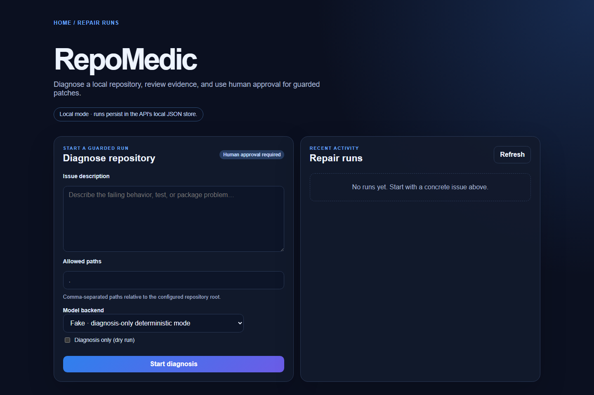
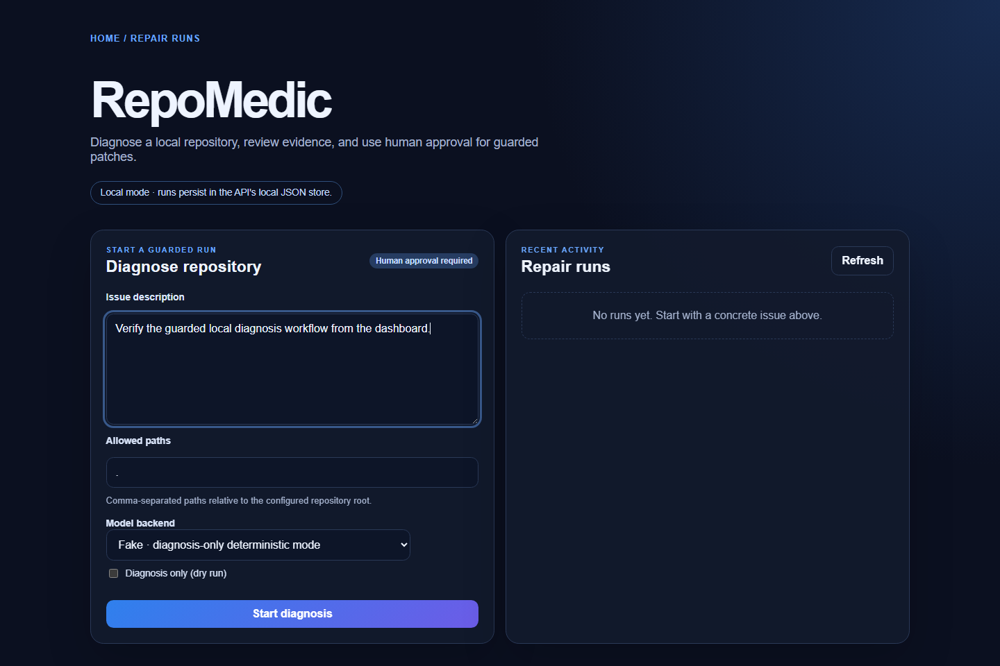
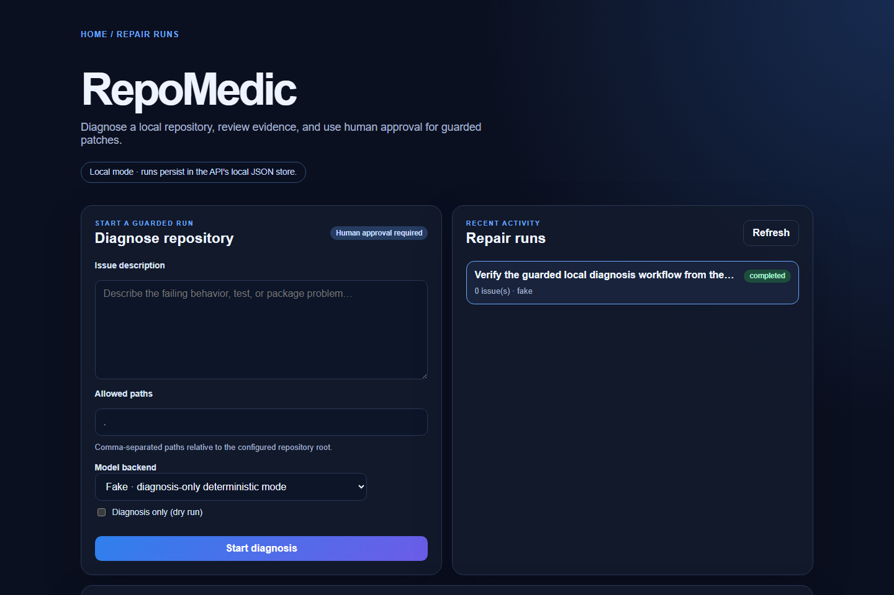
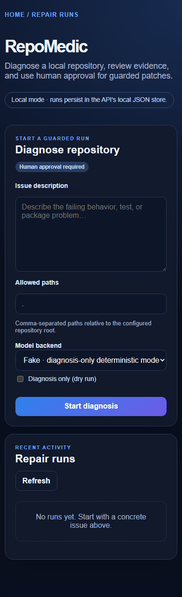

# Product walkthrough

RepoMedic's dashboard is a local-first surface for submitting a repository
issue, reviewing diagnosis evidence, and making the explicit human decision
required before a guarded patch can mutate files.

## Captured states

These images are a reviewed snapshot of the built Next.js dashboard talking to
the local Express API with the deterministic `fake` backend. The session is
diagnosis-only evidence; it is not a live provider demo and it does not prove
that a patch was applied.

_Fresh dashboard state: the local mode, human-approval boundary, allowlist, and
diagnosis-only backend are visible before a run starts._

_Composer state: a concrete issue is ready to submit while the configured
allowlist and deterministic backend remain visible._

_Completed state: the run list records a successful deterministic diagnosis with
zero actionable issues; no mutation is implied._

_Responsive empty state at a 390px viewport. This capture intentionally avoids
machine-specific repository paths and disposable run identifiers._

_Short loop: empty state → issue composer → completed diagnosis-only result._

## Provenance and regeneration

The media was captured on 2026-08-07 from the built artifacts at source SHA
`03db860b2a89b81e5d33f276efc2724448c6a795`:

- `apps/api/dist/server.js` served the API on loopback with a temporary data
  directory outside the repository.
- `apps/web` served the built dashboard on loopback.
- `npm run build` passed before capture; the API used port `4000` and the web
  app used port `3000`.
- Node.js `v24.12.0`, Chrome `150.0.7871.187`, and ImageMagick
  `7.1.2-23 Q16-HDRI` rendered and assembled the media.
- Chrome rendered desktop states at 1440×960 and the empty responsive state at
  390px; ImageMagick assembled six full GIF frames at 960×640.
- The captured API evidence was `status=completed`, `issues=0`,
  `proposal=null`, `finalStatus=no-op`, and `attempts=0`.

The desktop result image contains only the run summary visible above the fold;
the mobile image is a fresh empty state. Regenerating the media may change
timestamps, layout details, or the disposable local evidence. Re-capture only
after verifying the current build and review the output visually before
replacing checked-in media.

## Review manifest

| File                           | Dimensions | Frames | SHA-256                                                            |
| ------------------------------ | ---------: | -----: | ------------------------------------------------------------------ |
| `dashboard-empty.png`          |   1440×960 |      1 | `e9ce6938852da2da31d321348dd2a2672d83b5e738d9975414809a4266b89fcd` |
| `dashboard-composer.png`       |   1440×960 |      1 | `2439c014b7deee938dee7240e7bcd45ee44b16f4dd08d63cbcd4af6601e2c43f` |
| `dashboard-diagnosis-only.png` |   1440×960 |      1 | `6c0aa8ef8978828cb4a12a914cbe9eadc50191c54adc6c6eb61adedcbf6877e6` |
| `dashboard-mobile.png`         |   390×1277 |      1 | `4827c3ba88e08813b94ee1b08dc4cbe914be9e2be7f56322a091a996efae06ff` |
| `repair-workflow.gif`          |    960×640 |      6 | `2e9cff7c10368e59d063bf5d4f1e835e6e749f7036fc51ad480fed8420eadc42` |

## Evidence boundaries

This walkthrough verifies the dashboard's local presentation and the
diagnosis-only API path. It does not verify an OpenAI request, deployment,
registry publication, multi-user authentication, or a successful guarded patch
application. Those claims require their own live integration evidence.
